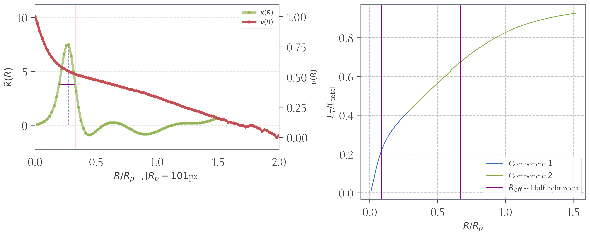
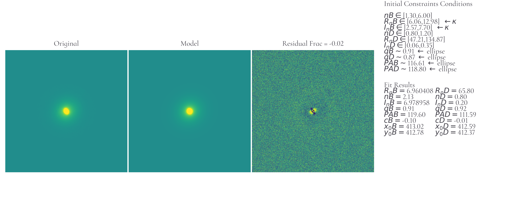

# Kurvature

Kurvature is a new approach to extract information regarding the structure of
galaxies, in terms of the components they are constituted, such as bulges, disks,
bars, etc. Kurvature is based on derivatives of the light profile of the galaxy
and these operations accounts for every variation of the slope of the
profile. We are searching for clues that each components has its own curvature
behaviour. Also, this approach can be used to constraint the scale length of
multiple components.

More details can/will be found here: <br>
(Lucatelli & Ferrari, 2019) > https://doi.org/10.1093/mnras/stz2154 | https://arxiv.org/abs/1907.10188 <br>
(Lucatelli et al, in prep 2020/2021)


To run the code ```kurvature.py```, just download it with ```kurvature_libs.py```. Download the
entire folder to see the examples: ```git clone https://github.com/lucatelli/kurvature.git```

OBS: The current stage of the code is unstable and may give unreliable results (or some errors).
A stable version is under development. For the moment, if your input data is in the same ways as will 
be explained bellow, the code should work fine.

Disclaimer: Derivative operations on signals are highly sensitive, therefore the
results are also sensitive in the way the filter operates. Kurvature needs to take
twice derivatives on the signal, and many other operations behind it are done
(filtering). The current stage of the code is a initial test in how the
approach can be used in galaxy structural analysis, however, the output
results may change significantly in different data, e.g. different image sizes,
different signal-to-noise levels, etc.

The next step is to improve the filtering routines in order to decrease
information loss by filters (attenuation) and decrease noise effects caused by
derivative amplifications. Also, stable quantitative statistical measurements 
on the profile are in under implementation and improvements. 
<b> Suggestion of any kind are very welcome! </b>

## How to run the code.
There are two ways in which the code can be used. One, is just to apply it to the galaxy
1D light profile (profile I as a function of the projected radius R).
The second option is to use some of the results obtained above to
constrain the Sérsic parameters of (at the current stage) a bulge-disk decomposition model.  
This can be done using two methods: i) using a internal routine; and ii) also using IMFIT (https://www.mpe.mpg.de/~erwin/code/imfit/).

 > ### 1. Single Profile

Single profile means that your input data contains the light profile of the galaxy
(like a csv table -- comma separated values) and the radial values. However, the radius data 
is optional for linear spaced values and if it has units of pixels. 
The header of your file need to have the same structure that is indicated in the code.
For example, in the file ```lenticular_IR.csv```
the header is ```# Raios,IR, ...```. The order does not matter, just the exact key must be equal. 

  > #### 1.1 Case 1: Analyse and interprete the behaviour of curvature.
  To just run kurvature and see its behaviour in the galaxy profile, run it only
  in the profile:

```
python3 kurvature.py --pr input_intensity_data.csv [REQUIRED] --r input_radii [OPTIONAL] --show
```

There is an example file to run:

```
python3 kurvature.py --pr examples/lenticular_IR.csv --show
```
 

The peak in curvature (green) indicates the probable region of transition between the bulge (component 1)
and the disk (component 2).

  > #### 1.2 Case 2: Constrain Sérsic parameters for a bulge-disk decomposition
 
  Run with last option + Constrained Sérsic2D model of bulge+disk decomposition.
  The option flag to call is ```--i``` (image fits file). The contraints are
  performed using the curvature peak and using elliptical fitting in order to obtain automatically the
  guess values of position angle and semi-axis ratio (in inner and outer regions). A good initial constraints for these 
  two quantities are fundamental for the convergence of the fit model. 
  The fit is done internally, using constrained last-squares (https://docs.scipy.org/doc/scipy/reference/generated/scipy.optimize.least_squares.html) and also using IMFIT code. NOTE: Add ```imfit``` to your ```/usr/bin/``` folder
  or specify where it is located inside the code.

  Example:
  ```
  python3 kurvature.py --pr examples/lenticular_IR.csv --i examples/lenticular_galpetro_nostars.fits --show
  ```


  OBS: All these routines are in an alpha stage and there are a lot of improvements to be made.


 > ### 2. Multiple Profiles (<i> *** under development *** </i>)
